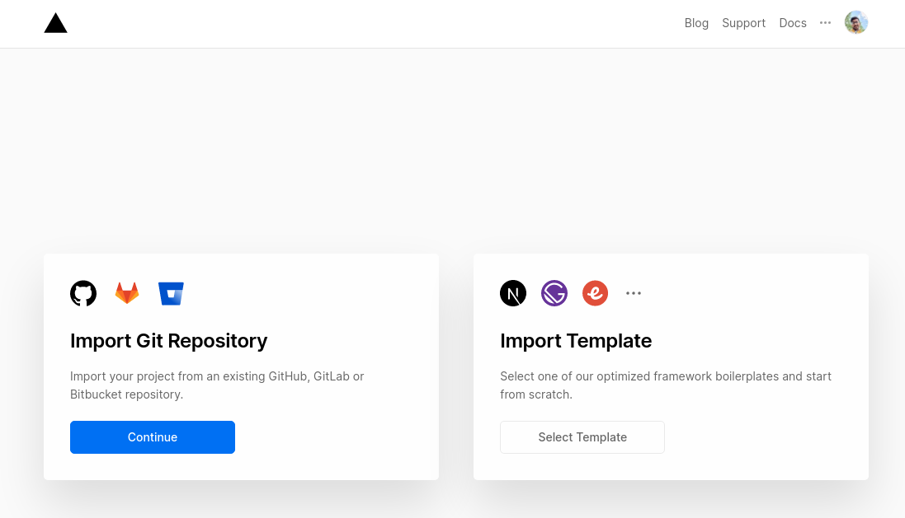
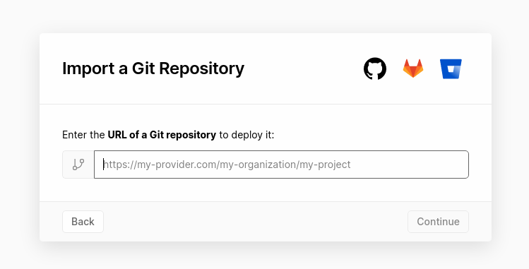
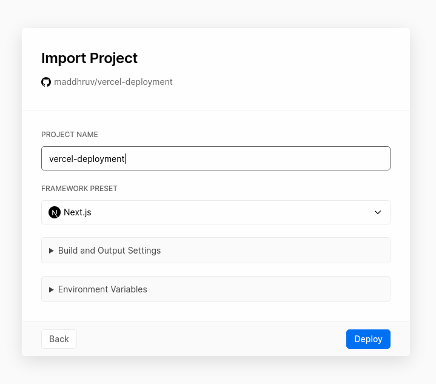

[Vercel](http://vercel.com/) (formerly Zeit) is a cloud platform for your web apps - Static, JAMStack, Serverless. And can be easily used in integration with Git for optimal workflow and CD (Continuos Deployments).

This guide will show you how to setup Vercel (Zeit now) for your React (Next.js) project and that too without Vercel's Team (Pro) Plan.

### Prerequisites for the Guide/Setup

- [Vercel Account](https://vercel.com/signup)
- Vercel CLI `npm i -g vercel`

### GitHub Repository for the Code

[https://github.com/maddhruv/vercel-deployment](https://github.com/maddhruv/vercel-deployment)

### Step 1: Import Project

This setp will cover on how to import a project to your vercel account from a git repository, if you have already created a project, you can simply skip to [Step 2](#step-2-vercel-deployment)

#### Step 1.1

Visit [Vercel Dashboard](https://vercel.com/dashboard) and click on `Import Project` Button


#### Step 1.2

Now you will be taken to the [Import Project](https://vercel.com/import) page.



On this page, select the first option i.e. **Import Git Repository**.

#### Step 1.3

On continuing you will be prompted for a git repository URL, here enter the url for your project repository and then _continue_



#### Step 1.4

After continuing you have to configure your project/app. Enter details - _project name_, _framework preset_, _build and output settings_, and _environment variables_.



Now Vercel will start building the application from the repository and will finish with a **Congratulations! - Your project has been successfully deployed.**

WoHoo! 🎉 🎉 🎉 You have successfully completed the first step and have deployed the applications.

But wait! Are you able to trigger the deployments on push to the repository? No! As we've not yet setup the integration with git to trigger automatic deployment. Now that leads us to the next step in the guide.

### Step 2. Vercel Deployment

This step covers the guide to trigger a deployment from your local repository so as to get the `PROJECT_ID` and `ORG_ID` for the vercel project we just created

#### Step 2.1

Login with your vercel account

Run `vercel login`

#### Step 2.2

Inside your project repository, run `vercel deploy` and follow the guide for prompt -

`Set up and deploy [Y/n]`

enter **Y**

`Select your username/orgname`

`Found project "...". Link to it? [Y/n]`

ensure that this is your project, otherwise select the appropriate project

`Deploying Project`

now vercel will start deploying your local repository to the remote vercel project and link both of them here, by creating a directory called `.vercel`

Bravo 🕺 🕺 🕺, we have completed our second step as well.

### Step 3. Git Integration

Now all that is remaining is to setup continuous deployment from the git repository. For this, we'll require three things - vercel token, project, id, and org id.

#### Step 3.1

Let's start by creating a vercel token. Simply go to [Account Tokens](https://vercel.com/account/tokens) in your account settings and click on `create` button.


Enter a name for your token. And the token will be created, just copy the token on the screen and save it somewhere for later use.

#### Step 3.2

Copy the `orgId` and `projectId` from the `.vercel/project.json` file created in your local repository.

#### Step 3.3

Setup enviornment variables for your git repositry.

Go to - [https://github.com/maddhruv/vercel-deployment/settings/secrets](https://github.com/maddhruv/vercel-deployment/settings/secrets) your repository _secrets settings_, replace the _org/repository_ with yours.
And create three secrets -

- `ZEIT_TOKEN` - Enter the name as `ZEIT_TOKEN` and add the value as the token created in step 3.1.
- `ORG_ID` - Enter the name as `ORG_ID` and add the value as the `orgId` copied in step 3.2.
- `PROJECT_ID` - Enter the name as `PROJECT_ID` and add the value as the `projectId` copied in step 3.2.

#### Step 3.4

Use GitHub Actions for Continuous Deployments from your branch.

Create a file called `deploy.yml` in your `.github/workflows` directory, this actions configuration will trigger deployments whenever something is pushed to the `master` branch here.

Add the following content to the `deploy.yml` file -

```yml
name: deploy
on:
  push:
    branches:
      - master
jobs:
  deploy:
    runs-on: ubuntu-latest
    steps:
      - uses: actions/checkout@v2
      - uses: amondnet/now-deployment@v2
        with:
          zeit-token: ${{ secrets.ZEIT_TOKEN }}
          now-org-id: ${{ secrets.ORG_ID}}
          now-args: "--prod"
          now-project-id: ${{ secrets.PROJECT_ID}}
```

#### Step 3.5

Push your changes to the remote branch and see the magic 🎱 🎱 🎱

### Step 4

There is no step 4, it is just you and the guide.

Follow me on [GitHub](https://github.com/maddhruv) for more updates
