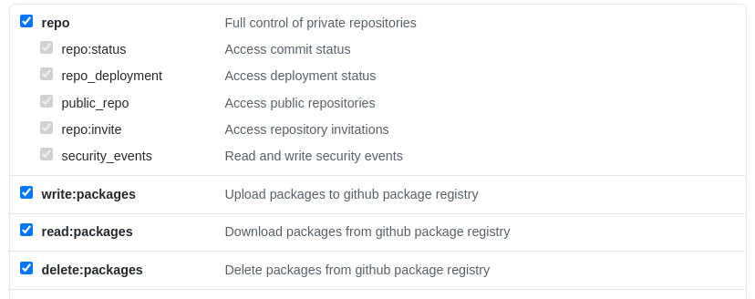

[GitHub Packages](https://github.com/features/packages) is an npm registry for your node/npm packages - private or public, just simply hosted at GitHub for you.

GitHub Packages can be easily used to publish private packages for your organization or self.

This guide covers how to use the packages in [GitHub Actions](https://github.com/features/actions). Pre assuming that you have already published a package on GitHub Packages (let's call it _@foo/bar_, where _foo_ is your scope and _bar_ is the package name).

Let's divide the whole procedure into steps 🛵:

Step 1. As [GitHub Help says](https://help.github.com/en/packages/using-github-packages-with-your-projects-ecosystem/using-github-packages-with-github-actions#:~:text=GITHUB_TOKEN%20cannot%20install%20packages%20from%20any%20private%20repository%20besides%20the%20repository%20where%20the%20action%20runs), the default `GITHUB_TOKEN` cannot install packages from any private repository besides the repository where the action runs. So, for accessing other private packages, we need to get a [personal access token](https://help.github.com/en/github/authenticating-to-github/creating-a-personal-access-token) with the following scopes:

- `repo`
- `write:packages`
- `read:packages`
- `delete:packages`



This token will ensure 🐕 that you don't have any `Unauthorized Access or 401` errors.

Step 2. Create a new `SECRET` in the consuming repository. [How to add a Secret](https://help.github.com/en/actions/configuring-and-managing-workflows/creating-and-storing-encrypted-secrets#creating-encrypted-secrets-for-a-repository). Let's name the secret as `GP_TOKEN`. That's all on Step 2 🤗.

Step 3. And the final step 🏁. In your `[action].yml` file, add one more step before dependencies installation -

```yml
- name: Create .npmrc
  run: |
    echo "//npm.pkg.github.com/:_authToken=${{ secrets.GP_TOKEN }}" >> .npmrc
    echo "@foo:registry=https://npm.pkg.github.com" >> .npmrc
```

Replace _foo_ with your package's organization scope and yeah!! you are good to go.
This step will create a `.npmrc` file in your repository on the GitHub Action's machine signifying the registry to fetch the corresponding scoped packages.

`git push` and enjoy GitHub Packages 🍿 🍿 🍿.
