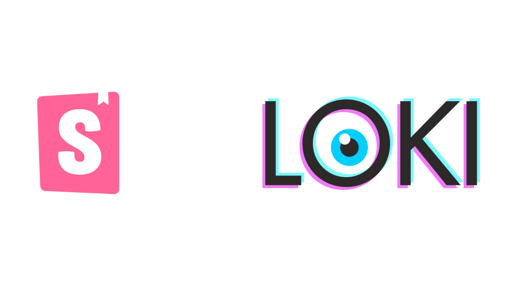
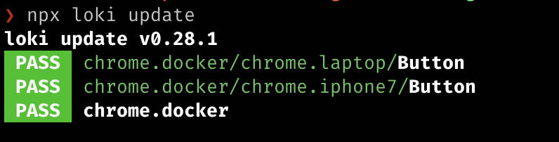
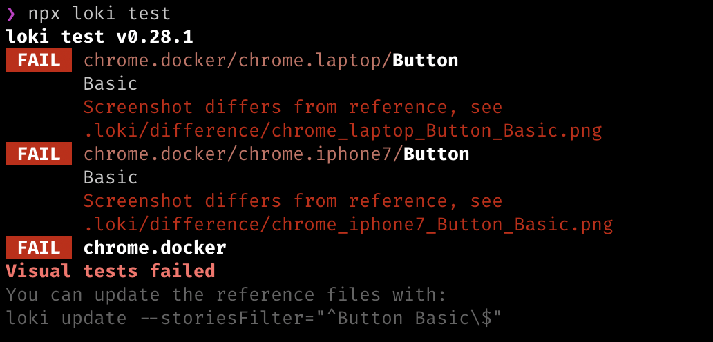

[Loki](https://loki.js.org/) is an easy-to-use visual regression tool for your storybook app that uses real browsers in docker environments and has multiple [diffing engines](https://loki.js.org/configuration.html#diffingengine) to enable image comparisons.

In this guide, we will walk through the integration of Loki with the storybook to enable visual regression for your stories. This guide doesn't cover any arguments on why and where to use visual regression testings. This guide covers:

- setting up Loki
- skipping stories
- enable Loki testing on GitHub Actions (CI)
- some tips to follow

Throughout this guide, we will be using this repository [maddhruv/storybook-loki-integration](https://github.com/maddhruv/storybook-loki-integration) as a reference to the integration.

Let's get started.

## Prerequisites

- Docker (for certain targets)

## Install Loki

It is preassumed that your app has storybook integrated and working. Install loki as a dev dependency to your node app.

`npm i loki -D` or `yarn add loki -D`

And that's it, installation is as easy as that.

## Setup Loki

Loki comes with an in-built command to initialize the loki [configuration](https://loki.js.org/configuration.html) which is `loki init` but I will not recommend you to use that, as it adds the configuration to the *package.json* by default and sometimes the overrides are not what you would want.

But what is the issue in adding the config to the *package.json*, no there is not unless your want to write custom formatter and enable the testing on CI. Don't worry, we will get to it in a moment.

For now, let's create a file called `loki.config.js` and add the following configuration to it.

```js
module.exports = {
  configurations: {
    'chrome.laptop': {
      target: 'chrome.docker',
      width: 1366,
      height: 768,
      deviceScaleFactor: 1,
      mobile: false,
    },
    'chrome.iphone7': {
      target: 'chrome.docker',
      preset: 'iPhone 7',
    },
  },
};
```

It just enables the testing on two targets - chrome on docker as desktop and chrome on iPhone7. You can configure your targets or devices using the `target` options here - [#configurations](https://loki.js.org/configuration.html#configurations). The testing time is linearly proportional to the number of targets.

## Run Loki

It's time to run loki and add snapshots. For the first time, you would need to run `loki update` to add all the possible snapshots/screenshots. This will create a `.loki` directory and save all the snapshots there.

`loki update`

`update` by default runs on the `6006` port. You may need to pass the storybook app port to the command above, use the options `--port` for that, and run your storybook app before running loki.

`loki update --port 1337`

> Loki update will fetch the required docker images for you and then update the snapshots



All the generated screenshots are available under `.loki/reference` directory.

## Run Test

After when you have generated the snapshots. It is time to run the actual tests if anything has changed visually. Just make any changes to your components/stories and then run.

`loki test`

This command will go through all the screenshots in `.loki/reference` directory and compare them with the newly available ones and if there is a difference, loki will create the regression images in `.loki/difference` directory which is a git ignored directory as the diffs are not required to be added.



That's it, you can add these commands as npm scripts.

```json
{
  "loki:update": "loki update",
  "loki:test": "loki test"
}
```

## Custom File Name Formatter

You can very easily change the loki generated file names, by creating a custom function in the `loki.config.js` file under `fileNameFormatter` option.

```js
{
fileNameFormatter: ({ configurationName, kind, story }) =>
    `${kind} > ${story} on ${configurationName.split('.')[1]}`.toLowerCase()
}
```

Where `kind` is the story kind (e.g. Button), `story` is the sub-story of `kind` (e.g. Primary Button) and `configurationName` refers to the keys in `configurations` object in the config or targets.
With the above formatter, the generated file names would be like `Button > Basic on iPhone7`.
To define custom javascript functions and code, your loki config needs to be `.js` and not in the *package.json*

## Skip Stories

Sometimes you want your stories to be skipped from the testing, just like `it.skip` in jest.

It is very easy to do that.

### All stories

If you want to skip all your stories from a component/module, pass these parameters in the `export default`.

```js
export default {
  component: Button,
  title: 'Button',
  parameters: {
    loki: {
      skip: true,
    },
  },
};
```

### Selected stories

Or if you just want to skip a particular story, pass the parameter as properties to the story.

```js
Basic.parameters = {
  loki: {
    skip: true,
  },
};
```

## Run on CI (GitHub Actions)

Running loki on the CI is also very easy. But there is a caveat that is not mentioned in the docs very clearly. For running loki on CI, you should build your storybook and then run loki on the built static app as it may speed up the page loads and will run the tests faster.

Add the following command as an npm script.

```json
{
  "loki:ci": "loki --requireReference --reactUri file:./storybook-static"
}
```

where the `reactUri` refers to the storybook build directory and `requireReference` fails stories when their reference images are not available.

The CI step may fail with this kind of an error - 
`FAIL chrome.docker/FETCH_STORIES: 1 request failed to load; file:///var/loki/iframe.html`, please refer to this comment for further details - [https://github.com/oblador/loki/issues/9#issuecomment-667277448](https://github.com/oblador/loki/issues/9#issuecomment-667277448)

To fix this, add an option to your config, which will ensure that docker would use the available copy.

```js
{
  chromeDockerUseCopy: !!process.env.CI
}
```

## Tips

- Use `http/https` protocol to load assets, for example, to load images don't use `//www.` format, but use `https://www.` format, as the loki runner use file protocol to load the pages and the former one would not resolve in this case.
- Try to use as lightweight images/assets as possible, because it will reduce the flakiness of snapshots if during that moment the assets are loading.

---

Refer to this repo - https://github.com/maddhruv/storybook-loki-integration and this commit for full integration changes - https://github.com/maddhruv/storybook-loki-integration/commit/e40828148b75c4abb6b02786a7f07204eadaab46