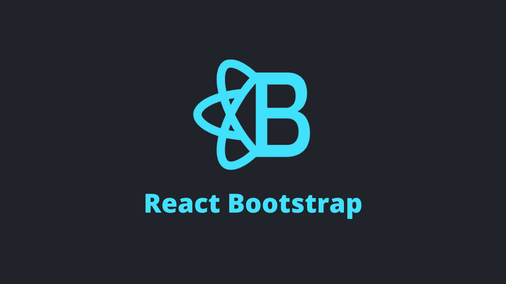

In this comparision guide, we’re going to look at some of the best React UI Components Libraries/Frameworks/Kits that you can use in your next react app/project.

Before writing the content of this blog I have evaluated a ton of them on the following criterias which I feel are worth checking, before choosing any one of them. There is no winner or loser in this race, just choose the one which fits your requirements.

- Quantity of Components
- Tree-shakeable
- SSR
- Customizability - Custom Theme and Components Overrides
- Typescript
- Docs
- Websites using the library
- Size Cost

## Material UI

The Material Design Inspired - MUI or Material UI is a wonderful library for your next project, as it comes with over 41 commonly used fully-fledged UI components and yeah built in [TypeScript Support](https://material-ui.com/guides/typescript/). [Bundle Minimization or Treeshakeability](https://material-ui.com/guides/minimizing-bundle-size/) can be easily achieved with path imports and ES Modules. And as the Docs say [“Material-UI was designed from the ground-up with the constraint of rendering on the server”](https://material-ui.com/guides/server-rendering/#material-ui-on-the-server) and hence is very SSR Friendly. With over 60K GitHub Stars and 17K Forks, MUI is one of the most popular React Repositories you can find on the web. The library and the components can be easily customized as per need, using a custom Theme or the withStyles HOC. Material-UI comes with a package [cost of 425kB and 101kB gzipped](https://bundlephobia.com/result?p=material-ui&)

[Docs 📔](https://material-ui.com/) [Repository 📦](https://github.com/mui-org/material-ui/)

---

## Ant Design

Another popular enterprise-class UI design language and library, which has components libraries not just for React, but for Angular and Vue as well. The library covers about 60 UI elements. Ant Design is written in [TypeScript, which benefits in property suggestions and typing checks](https://ant.design/docs/react/use-in-typescript). AntD allows custom design tokens and themeing using less variables, which makes customizations easier and harder at the same time, Easier by providing a minimal contract to modify the design token - by [pre-defined variables](https://github.com/ant-design/ant-design/blob/master/components/style/themes/default.less) and Harder - as you have to manually add support for less-loader in your [webpack config](https://ant.design/docs/react/customize-theme#Customize-in-webpack). The documentations are well organized and even provides you with several sandbox options for examples. The sad part is that many issues on the GitHub repo are in chinese due to the large chinese user base. Another very disturbing part is `moment.js` - AntD DatePicker uses `moment.js` on the other side, but that is no longer a problem now, the library has introduced [a way to use date libraries like dayjs](https://ant.design/docs/react/replace-moment), with which you can reduce the final bundle size by a huge margin. Ant Design comes with a package [cost of 1.2mB and 349kB gzipped](https://bundlephobia.com/result?p=antd&). [Internationalization](https://ant.design/docs/react/i18n) is one of the biggest points on using AntD as it supports tens of language out of the box and [adding new languages](https://ant.design/docs/react/i18n#Adding-new-language) is also very easy.

[Docs 📔](https://ant.design/) [Repository 📦](https://github.com/ant-design/ant-design/)

---

## React Bootstrap

Inspired by the most popular [Bootstrap](https://getbootstrap.com/)
